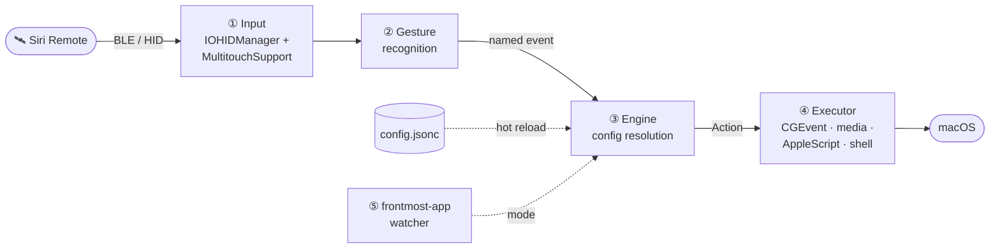
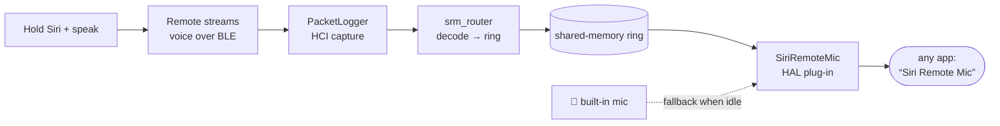

<div align="center">

# 🛰️ SiriRemoteForge

### Thirteen buttons. However many meanings you want.

[](LICENSE)
&nbsp;
&nbsp;
&nbsp;
&nbsp;

*The Apple TV remote in your drawer is a 27 mm square of glass and thirteen buttons.*
*This turns it into a Mac controller where **you** decide what each of them means — and where the*
*meaning changes with whichever app you happen to be looking at. If you're brave, it can even become*
*a microphone.*

</div>

---

> **TL;DR** — Remap every button, the click-ring, the trackpad, and swipes to any action; make one
> key mean six things; swap the whole remote with layers; drive the cursor from the glass; and
> reconfigure the entire device by editing **one hot-reloading file**. No settings screen required.

```jsonc
// Back button: tap deletes, hold half a second closes the window,
// hold a bit longer quits the app. Each delay is set independently.
"button.menu":       { "action": "keystroke", "keys": "delete" },
"button.menu.hold":  { "action": "closeWindow", "after": 0.5 },
"button.menu.hold2": { "action": "applescript", "after": 1.2, "script": "…" },

// …but in a browser, "back" means back.
"browser": {
  "button.menu": { "action": "keystroke", "keys": "cmd+[" }
}
```

Save the file and it takes effect. No restart, no reconnect, no settings screen to click through —
which also means an agent or a script can reconfigure the whole device by editing one file.

**What you get**

- Every input is remappable: buttons, the click-ring, the trackpad, swipes, two-finger tap.
- A key can mean up to six things — tap, double-tap, triple-tap, and up to three long-press
  stages, each with its own delay. An on-screen card shows what you'll get if you let go now, and holding past the
  last stage cancels.
- Per-app profiles that fall through an inheritance chain, plus **layers** that swap the whole
  remote at once (momentary while held, or sticky).
- The glass drives the cursor with tunable acceleration, iPod-style circular scroll, sticky drag,
  shake-to-find, and press-to-click.
- A radial app launcher, animated Space switching, window controls, brightness, and a native
  settings app with a drawn, clickable remote.

> **Scope.** macOS only, and it uses private frameworks (MultitouchSupport, SkyLight) to reach the
> trackpad and Spaces — so it is not sandboxed and can never ship on the App Store. Build it
> yourself; there is no signed release. This is a power tool, and it asks for the permissions one
> needs: Accessibility and Input Monitoring.

---

## What it does

- **Everything is remappable.** Buttons (Back/Menu, TV, Siri, Play/Pause, Mute, Volume ±, Power),
  the click-ring (up/down/left/right + center), one-finger swipes, and two-finger tap — each maps
  to any action.
- **Trackpad → cursor.** The remote's glass trackpad drives the mouse pointer with tunable speed,
  a steadiness dead-zone, velocity-based pointer acceleration, press-to-click freeze, tap-to-click,
  and iPod-style **circular scroll** (circle a finger on the outer ring to scroll).
- **Per-app profiles.** The frontmost app selects a *mode* (e.g. a browser mode, a terminal mode);
  bindings fall through a `inherits` chain to a global default, then to the remote's native behavior.
- **Layers.** A key can toggle a **layer** (like a keyboard layer): tap it to switch a sticky layer
  on/off, or hold it for a momentary layer. Layers **compose with the app** — the same layer can do
  different things in different apps. An on-screen HUD confirms the switch.
- **Multi-stage long-press** (`.hold` / `.hold2` / `.hold3`, release-to-select), **multi-tap**
  (`.double` / `.triple`), and **hold-to-repeat** (auto-repeats a keystroke while held).
- **Extras:** power button dims all displays *instead of sleeping or locking the Mac* (macOS's own
  power-button hotkey is suppressed for the remote only — your Mac's physical power button is
  untouched), and any touch restores them; a HUD confirms the remote connecting and disconnecting;
  shake the cursor to flash a "find my pointer" highlight; animated macOS **Spaces** switching.
- **Two ways to configure:** hand-edit `~/.config/siriremote/config.jsonc` (hot-reloads on save), or
  use the built-in **Settings** app — a Tuning tab (sliders) and a Layout tab (a drawn remote + an
  inline, click-to-edit mapping editor with per-app layers).

---

## How it works



The shipping app has two Swift halves, plus a self-contained virtual-microphone subsystem and an
older DriverKit experiment:

- **`SiriRemoteCore/`** — a pure-Swift, dependency-free, unit-tested engine (a SwiftPM package). It
  owns the config model (JSONC parsing, the `Action` enum, per-app modes + `inherits` resolution,
  layers, multi-stage hold thresholds), the config **write-back** (serialize a `Config` back to
  JSONC so a UI edit round-trips), and the circular-scroll math. No AppKit, no I/O — trivially
  testable (`swift test`).
- **`app/`** — the native macOS layer built with `swiftc` (see `app/build.sh`). It seizes the remote
  over HID (`IOHIDManager`), reads the trackpad via the private `MultitouchSupport` framework,
  recognizes gestures, watches the frontmost app, and executes actions with CGEvent / media-key /
  AppleScript / shell. It also hosts the SwiftUI **Settings** window. The core package is compiled
  straight into this binary (no separate library).
- **`mic/`** — the working **virtual microphone**: a CoreAudio HAL plug-in that publishes a
  "Siri Remote Mic" input device, fed by a Bluetooth-voice router and an on-demand root daemon.
  See [🎙️ Turn the remote into a microphone](#microphone).
- **`driverkit/`** — an earlier HIDDriverKit microphone-replacement proof of concept (superseded by
  `mic/`; kept for reference). Build/sign scripts do not install or activate it.

---

## Requirements

- macOS 13+ (Ventura or later), Apple silicon or Intel.
- A **3rd-generation Siri Remote** (2022, USB-C). Pair it over Bluetooth first (hold it near the Mac;
  it appears as a keyboard/trackpad device).
- Xcode command-line tools (`xcode-select --install`) for `swiftc`.

**No third-party tools.** Animated Space switching was once routed through BetterTouchTool; it now
goes through System Events, which needs Automation permission (macOS asks once) — see the `space`
action.

---

## Build & run

```sh
cd app
./build.sh              # compiles the app + SiriRemoteCore into ./HyperVibe
./create_app_bundle.sh  # wraps it into HyperVibe.app (icon auto-generated, code-signed)
open HyperVibe.app
```

`build.sh` produces a bare `./HyperVibe` you can also run directly (`./HyperVibe --settings` opens
the settings window on launch). `create_app_bundle.sh` packages a double-clickable `HyperVibe.app`.

**It's a menu-bar app** (no Dock icon): after launching, click the walkie-talkie icon in the menu bar
for **Settings… / Quit**. If the menu-bar icon is hidden (e.g. behind the notch), just **double-click
`HyperVibe.app` again** — that reopens the Settings window.

### Permissions

macOS gates the low-level access this app needs. On first run, grant it in
**System Settings → Privacy & Security**:

- **Accessibility** — to move the cursor and post keystrokes.
- **Input Monitoring** — to receive the remote's buttons over HID. If the buttons don't respond,
  this is almost always why (the log shows `IOHIDManagerOpen failed 0xE00002E2`).

The bundle is signed **without** the hardened runtime on purpose — under the hardened runtime the
private MultitouchSupport touch callback trips code-signing enforcement and the app is killed the
instant you touch the trackpad. `create_app_bundle.sh` prefers a stable local self-signed identity
(`siriRemote Local Signing`) if present, so permissions survive rebuilds; otherwise it ad-hoc signs.

### Required system setting if you bind the Power button

**Only needed if you map `button.power`.** Skip this otherwise.

macOS translates the remote's Power button into the *system* power-button hotkey. `loginwindow`
acts on that (`PBSleepsMachine`) and sleeps/locks the Mac — **in addition to** running whatever you
bound, so a Power binding would dim your screen *and* lock it. Turn that behaviour off:

```sh
sudo defaults write /Library/Preferences/com.apple.loginwindow PowerButtonSleepsSystem -bool false
```

It takes effect immediately (loginwindow re-reads the pref on every press). To undo, write `true`.

**What this changes:** your Mac's own physical power button no longer sleeps the machine on a short
press. Touch ID, holding it for the force-shutdown dialog, closing the lid, and the Apple menu's
Sleep all keep working.

**Getting sleep back on the remote** — bind a long press, which the app *can* control:

```jsonc
"button.power":      { "action": "brightness", "value": 0.0 },          // tap → dim
"button.power.hold": { "action": "shell", "command": "pmset sleepnow" } // hold ≥ holdThreshold → sleep
```

> **Why not just intercept the event?** It was tried thoroughly and it cannot work. Measured
> directly: with a `CGEventTap` consuming **all 33** of the power events it saw, and with all seven
> of the remote's HID interfaces seized, `loginwindow` still received the button and slept the Mac.
> It reaches loginwindow by a path userspace cannot intercept, so the preference above is the only
> real lever. Short presses *appeared* to work only because loginwindow debounces them at 350 ms —
> which is also why long presses failed every time. See `HANDOFF.md` for the full evidence.

Pressing Power also opens a **1-second input guard**: the button sits right next to the glass, so
the press almost always brushes the trackpad, which used to instantly undo the dim it had just
triggered. During the guard, touches and other buttons are still read but do not fire actions.

---

<a id="microphone"></a>

## 🎙️ Turn the remote into a microphone

The 3rd-gen Siri Remote has a genuinely good close-talk microphone — the one you'd hold up and speak
into. macOS never exposes it (it isn't a standard Bluetooth audio device), so `mic/` builds one: a
CoreAudio device named **"Siri Remote Mic"** that any app can select.

**Hold the Siri button and speak → your voice arrives from the remote's close mic. Let go → it
seamlessly falls back to the Mac's built-in mic.** Pair that with a push-to-talk binding and it's a
dictation setup where the mic is always in your hand.



Under the hood: an on-demand **root LaunchDaemon** (`mic/captured/`) runs Apple's PacketLogger only
while some app is actually using the device; **`srm_router`** (`mic/router/`) decodes the remote's
proprietary BLE voice notifications into a lock-free shared-memory ring; and a **HAL plug-in**
(`mic/driver/`, a hardened fork of [BlackHole](https://github.com/ExistentialAudio/BlackHole))
serves that ring — or the built-in-mic fallback ring — to CoreAudio, crossfading on every hand-over.

> [!IMPORTANT]
> **This half is power-user territory and has real caveats:**
> - It requires Apple's **PacketLogger** (free, in [*Additional Tools for Xcode*](https://developer.apple.com/download/all/?q=Additional+Tools+for+Xcode)) at `/Applications/PacketLogger.app` — it is **not** bundled.
> - It installs a HAL plug-in into `coreaudiod` and a root daemon, and it enables Bluetooth HCI debug traces. This is a system-level change; read `mic/README.md` first.
> - It works by **interoperating with Apple's undocumented remote-voice protocol** (reverse-engineered). It's a research/interop feature, is fragile across macOS versions, and carries a small (~1–2 s) switch latency.

Setup lives in [`mic/README.md`](mic/README.md) and the per-component `install.sh` scripts. A
one-double-click installer that bundles everything is in [`dist/`](dist/README.md).

---

## Configuration — `~/.config/siriremote/config.jsonc`

JSONC (JSON + `//` comments). A default is written on first run. **Saving hot-reloads it live.**
Three top-level keys: `settings`, `appProfiles`, `modes`. A complete, working example to crib from
lives in [`examples/config.jsonc`](examples/config.jsonc).

```jsonc
{
  "settings": { "defaultMode": "global", "cursorSpeed": 1.4, /* … tuning … */ },

  // Frontmost app's bundle id → mode name (plus a "default").
  "appProfiles": {
    "com.google.Chrome": "browser",
    "dev.warp.Warp-Stable": "terminal",
    "default": "global"
  },

  "modes": {
    "global": {
      "button.tv":  { "action": "layer", "to": "L1" },          // TV button = layer L1
      "ring.left":  { "action": "keystroke", "keys": "left" },
      "ring.up.hold": { "action": "shell", "command": "open -a 'Mission Control'" }
    },
    "browser": {                                                 // inherits global, overrides some keys
      "inherits": "global",
      "button.menu": { "action": "keystroke", "keys": "cmd+[" }, // Back button = history back
      "L1.ring.left":  { "action": "keystroke", "keys": "cmd+opt+left" }  // L1 in Chrome = prev tab
    },
    "L1": { "inherits": "global" }                               // layer marker (see Layers)
  }
}
```

### Event keys

`ring.up` `ring.down` `ring.left` `ring.right` · `select` (center click) · `touch` (surface) ·
`swipe.up` `swipe.down` `swipe.left` `swipe.right` · `tap.two` ·
`button.menu` (the Back ‹ button) `button.tv` `button.siri` `button.playPause`
`button.volumeUp` `button.volumeDown` `button.mute` `button.power`.

Suffix any button/ring key with:

- **`.double` / `.triple`** — multi-tap variants (`button.siri.double`, `ring.up.triple`). Taps are
  counted inside `doubleTapWindow`, and only the deepest count reached fires — a triple never also
  emits a double or a single.

  Each key waits exactly as long as its own bindings require, and no longer. A key with no
  multi-tap binding fires its tap on the press, with no added latency at all. Adding `.double` makes
  the double fire immediately on the second press. Adding `.triple` is the only thing that costs
  anything: that key's *double* must now wait one `doubleTapWindow` to see whether a third tap is
  coming. No other key is affected, and the plain tap is never delayed by either.
- **`.hold` / `.hold2` / `.hold3`** — multi-stage long-press (`ring.up.hold`). *Release-to-select:*
  keep holding to reach a deeper stage; the deepest stage reached fires when you let go.

### Actions

| `action`      | params                                | notes |
|---------------|---------------------------------------|-------|
| `keystroke`   | `keys` e.g. `"cmd+shift+["`            | modifiers cmd/ctrl/opt/shift (+ `l`/`r` variants like `rcmd`); a modifier-only string is a held hyperkey chord; keys: letters, digits, arrows, esc/enter/space/tab, punctuation |
| `media`       | `key`                                 | playpause/next/previous/volup/voldown/mute |
| `mouse`       | `op`                                  | click/rightclick/move/scroll |
| `launch`      | `app` and/or `url`                    | open an app or a URL |
| `shell`       | `command`                             | runs via `/bin/zsh -c` — the escape hatch |
| `applescript` | `script`                             | e.g. control Apple Music |
| `mode`        | `to`                                  | switch the active mode |
| `layer`       | `to`                                  | make this key a **layer** key (see below) |
| `space`       | `to`: `left`/`right`                  | switch macOS Spaces, animated, via System Events (needs Automation permission) |
| `fullscreen`  | —                                     | toggle the frontmost window's full screen, via the Accessibility API — synthesizing Ctrl+Cmd+F does not work |
| `minimize`    | —                                     | minimise the frontmost window (Accessibility API) |
| `closeWindow` | —                                     | press the window's red close button. NOT Cmd+W, which closes a *tab* in anything tabbed |
| `appWheel`    | —                                     | summon the radial launcher (`settings.appWheel`) |
| `repeatKey`   | `keys`, `delay?`, `interval?`         | auto-repeat while held (the remote sends no auto-repeat) |
| `brightness`  | `value` (0…1)                         | set all displays' backlight; `0` = min (used by Power to dim) |

### Layers (layer × app)

Bind a key to `{ "action": "layer", "to": "L1" }`. That key becomes a **layer key**:

- **Tap** it → toggle layer `L1` *sticky* on/off (persists until tapped again).
- **Hold** it and press other keys → *momentary* `L1` (active only while held).

**A layer is a modifier, not a second keyboard.** Holding one never turns a bound key into a dead
key: a key the layer says nothing about keeps doing whatever it does unlayered, *in the current app*.

While layer `L` is held, key `K` resolves most-specific-first:

| # | Lookup | Means |
|---|--------|-------|
| 1 | `"L.K"` in the active app mode's `inherits` chain | this app, in this layer |
| 2 | `"K"` among mode `L`'s **own** bindings | any app, in this layer |
| 3 | `"K"` in the active app mode's `inherits` chain | this app, **without** the layer |

Example: `L1.ring.left` = `cmd+shift+left` in `global` (the default) but `cmd+opt+left` in `browser`
(step 1); `terminal` binds `button.menu` to `repeatKey delete` and says nothing about it in `L1`, so
holding `L1` in a terminal still deletes (step 3).

A layer claims a button **whole**. Bind any variant — `L1.button.playPause`, or just its `.hold` —
and every other variant of that button resolves inside the layer only; the unlayered `.hold2` no
longer shows through underneath. A button is one thing, even though its variants live under separate
keys, and the alternative is writing explicit do-nothing bindings for each. A button the layer binds
no variant of still falls through entirely.

Two consequences worth knowing:

- **There is no fourth step for "any app, without the layer."** Steps 1 and 3 walk the *app* mode's
  `inherits` chain, and that is what reaches `global` — a key bound only in `global`'s base still
  resolves under a layer inside `terminal`, because `terminal` inherits `global`. Keeping this in
  `inherits` instead of hard-wiring a global fallback is what lets a mode opt out: a mode written
  without `inherits` is standalone and genuinely sees nothing else, layered or not. The flip side is
  that an app mode that forgets `"inherits": "global"` will only answer for the keys it lists.
- **Step 2 does not follow mode `L`'s own `inherits`.** Layer modes are written as
  `"L1": { "inherits": "global" }`, so following it would answer with `global`'s *base* binding and
  shadow step 3's app-specific one. Put app-agnostic layer bindings directly in the `L1` mode; they
  are step 2. Keep the marker mode so the layer exists.

### Labels and icons

Any binding may carry `label` and `icon`. They change nothing about what runs — they are how the
hold-progress HUD names the action you'd get by releasing right now.

```jsonc
"button.power.hold": { "action": "shell", "command": "pmset sleepnow",
                       "label": "Sleep", "icon": "moon.fill" },
```

`icon` is an SF Symbol name, and is usually unnecessary: an action that **opens** an app shows that
app's real icon *instead of* a label (`launch`, and `shell` commands written as `open -a "Some App"`),
and an action **aimed at** an app (`applescript` containing `tell application "X"`) shows that app's
icon *beside* its label. Otherwise a symbol is picked from the action kind.

**Presentation inherits down the mode chain on its own, field by field, independently of the
binding.** A key keeps its identity even where a mode re-binds it, so set `label`/`icon` once in
`global` and an app mode that overrides only the *action* still shows the same name and icon — no
duplication to drift out of sync. A mode that genuinely presents a key differently just says so, and
the nearer mode wins.

### Hold timing

Stages fire at `holdThreshold` / `holdThreshold2` / `holdThreshold3`, but any binding may set its
own with **`after`**:

```jsonc
"button.menu.hold":  { "action": "closeWindow", "after": 0.5 },
"button.menu.hold2": { "action": "applescript", "after": 1.2, "script": "…" },
```

The globals are shared by every key, so without this, tuning one button moved every other button
bound to the same stage — which twice forced a binding onto a stage it did not belong on purely to
leave another key's timing alone. **Stages are ordered by their effective delay, not by the suffix**,
so `.hold3` may perfectly well fire before `.hold`; the suffix is only a name.

`holdCancelGrace` is measured from the deepest stage that key actually binds, so a key whose deepest
hold is 0.5s does not sit through seconds of dead zone waiting to cancel.

### Focus follows cursor (apps that fill a display)

`"focusFollowsCursor": true` makes the app under the cursor frontmost once the pointer rests on it
(~0.15s), so a keystroke binding lands where you are pointing instead of wherever you last clicked —
scroll a browser on one display, press a button, and the shortcut goes to that browser.

**It only focuses an app whose windows already cover ≥90% of that display**, and that restriction is
the feature working, not a gap. macOS has no public way to give an app keyboard focus without also
raising it, so an unrestricted focus-follows-mouse would reshuffle your window stack every time the
pointer crossed something. An app that already fills a display has nothing to disturb — raising it
changes nothing you can see. Overlapping or half-screen windows are left alone.

Note it is *fills a display*, not *is fullscreen*. A maximised window with the menu bar still showing
is just as safe, and is what most people actually run; a literal fullscreen test matched none of the
author's own windows. Coverage is measured against the union of the app's windows on that display,
because some apps (Chrome) split their tab strip and content into separate windows that only cover
the display together.

Off by default — it changes which app receives your input, which should not be a surprise.

### App wheel (radial launcher)

`"appWheel": ["WeChat", "Google Chrome", "Music", "Warp"]` lists the apps, clockwise from the top;
empty disables it. Bind `{ "action": "appWheel" }` to a hold — typically the layer key's:

```jsonc
"button.tv":      { "action": "layer", "to": "L1" },
"button.tv.hold": { "action": "appWheel" },
```

It is an ordinary hold binding, so it gets the progress card and the cancel grace like any other,
and a layer key that carries hold stages still taps to toggle and still works as a momentary layer
when another key is pressed during the hold.

The wheel opens **centred on the pointer**, so choosing is a short flick outward rather than a trip
across the display — which matters on a 27 mm pad. Selection follows the CURSOR, not the finger's
position on the pad, so the trackpad behaves exactly as it always does. **Select** launches what is
highlighted; **any other button** cancels; nothing is highlighted while the pointer is in the middle
dead zone, so summoning it and pressing Select does nothing by accident.

### Settings (tuning)

All live in `settings` and in the app's **Tuning** tab: `cursorSpeed`, `cursorDeadzone`, pointer-accel
curve (`accelMin`/`accelMax`/`accelLowSpeed`/`accelHighSpeed`), `clickRiseThreshold`, `pressMoveMax`,
`holdThreshold`/`holdThreshold2`/`holdThreshold3`, `doubleTapWindow`, `spacesModeWindow`,
`findCursorEnabled`, `focusFollowsCursor`, and `circularScroll { enabled, minRadius, startThreshold,
pixelsPerRadian, scrollEase, invert }`. Config is the single source of truth — Tuning-tab slider changes are written
back to `config.jsonc` (debounced).

---

## The Settings app

- **Device** — live status for the paired remote: **battery %**, firmware revision, Bluetooth
  address, serial, vendor/product, and an expandable map of the seven HID interfaces macOS exposes.
  Battery also appears in the window header pill (`● Connected · 🔋 100%`) and turns orange/red as it
  drops. Battery/firmware come from the system Bluetooth stack (`system_profiler`, ~0.15 s, polled
  off the main thread); the interface map comes straight from `IOHIDManager`.
- **Tuning** — grouped sliders for cursor feel, acceleration, click, circular scroll, and button
  timing, each applying live. Ends with **Startup → Start at login**, which registers the app with
  `SMAppService` (macOS 13+). Registration is by bundle, so it follows `HyperVibe.app` and survives
  rebuilds in place; it also appears under **System Settings → General → Login Items**, so it can be
  turned off there even when the app isn't running. The toggle always re-reads the real
  registration, so it can't sit in a position macOS didn't accept — if macOS wants approval, the
  footer says so. Scriptable with `open HyperVibe.app --args --enable-login-item` (or
  `--disable-login-item`).
- **Layout** — "what every button does": a drawn aluminum remote on the left (click a button to jump
  to its mapping; the selected input stays highlighted), an **app hub** to pick the mode, an
  **Editing: base / layer** selector (the layer × app grid), and a grouped input→action list with
  Custom / Inherited / System tags. Click any input to open a docked editor for its
  Tap / Double-tap / Hold·· / Hold··· slots, written straight to `config.jsonc`.

---

## Repository layout

```
SiriRemoteForge/
├── SiriRemoteCore/        # pure engine (SwiftPM package) — config model, resolution, write-back, tests
│   ├── Sources/SiriRemoteCore/
│   └── Tests/SiriRemoteCoreTests/     # `swift test`  (config round-trip, resolution, layers, …)
├── app/                   # native macOS app (swiftc)
│   ├── *.swift            # HID, MultitouchSupport, gesture recog, executors, SwiftUI settings
│   ├── build.sh           # canonical build (compiles the app + ../SiriRemoteCore into one binary)
│   ├── create_app_bundle.sh
│   ├── tools/make_app_icon.swift
│   ├── SiriRemote-Bridging-Header.h / MultitouchSupport.h
│   └── HyperVibe.entitlements
├── mic/                   # virtual microphone (see the Microphone section)
│   ├── driver/            # CoreAudio HAL plug-in ("Siri Remote Mic"), a hardened BlackHole fork
│   ├── router/            # srm_router — decode BLE voice notifications → shared-memory ring
│   ├── captured/          # on-demand root LaunchDaemon (runs PacketLogger + router)
│   └── README.md
├── dist/                  # one-double-click installer that bundles all components
└── driverkit/             # earlier Siri Remote microphone DEXT proof of concept (superseded by mic/)
    ├── SiriRemoteMicDriver.xcodeproj
    ├── Host/               # separate OSSystemExtensionRequest host
    ├── build-driver.sh    # unsigned DEXT build only
    └── build-host.sh      # embeds DEXT; does not launch or activate
```

The app target is named `HyperVibe` internally (historical, from the fork below); the product is
"siriRemote".

## Development

```sh
cd SiriRemoteCore && swift test     # unit tests for the engine
cd app && ./build.sh                # build the app
cd driverkit && ./build-host.sh     # build-only DEXT + host check
```

Debug logging goes to `/tmp/hypervibe.log` (HID events, device selection, executed actions).

Current development state and continuation notes live in [`HANDOFF.md`](HANDOFF.md). The **working**
microphone device is the `mic/` Bluetooth-router pipeline described [above](#microphone). Getting
there meant ruling out the *in-band* approaches first; those dead ends and the full evidence log live
in [`docs/mic-reverse-engineering.md`](docs/mic-reverse-engineering.md).

The dead ends (all opt-in dev flags, absent from normal launch — kept for reference):

- `--dump-reports` — inventory IOHID reports and readable Feature values;
- `--activate-mic` — capture every remote interface and send the gen-3 `0xAF` input-enable byte;
- `--dump-gatt <remote-name>` — read-only CoreBluetooth inventory (blocked: macOS owns the connected
  HID service);
- `--native-ptt` — AppleBluetoothRemote's native `PushToTalk` property (returns `kIOReturnUnsupported`
  on the tested product `0x0315`);
- `--direct-ptt` — the driver's hidden Feature report `0x99` (the tested remote returns `kIOReturnError`).

An earlier native **DriverKit** proof of concept in [`driverkit/`](driverkit/README.md) builds and
development-signs, but a real host launch is killed by AMFI before `main` (`Code=-413`,
`No matching profile found`): a Personal development team cannot issue the required DriverKit HID
capabilities. It is superseded by `mic/` and kept only for reference.

Development invariant: a diagnostic instance temporarily replaces the normal app; it does not run
alongside it. After every diagnostic, stop the flagged process and restore exactly one no-argument
`HyperVibe.app` instance so remote control remains available.

## Hardware notes (3rd-gen Siri Remote)

- HID product `0x0315`, Apple BT vendor `0x004C`; the device name is the unit serial, so matching is
  by product id. The remote mirrors each logical button across several HID interfaces — duplicate
  callbacks are de-duplicated to a single state transition.
- The ring is a Consumer-page control (`0x42`–`0x45`); center = `0x80`. The Back (‹) button reports
  Generic-Desktop usage `0x86`, surfaced as **`button.menu`** (not `button.back`).
- The trackpad is read via `MultitouchSupport` (family 145, ~60 Hz over BLE); a press is detected by
  a sharp rise in contact size while the finger is still. No accelerometer/gyro on this generation.

## Contributing

Issues and pull requests are welcome — see [`CONTRIBUTING.md`](CONTRIBUTING.md). If you are picking
up where the last session left off, [`HANDOFF.md`](HANDOFF.md) is the honest state of things,
including what is unfinished and which ideas were tried and rejected (and why).

## Credits & license

SiriRemoteForge is licensed under the **GNU General Public License v3.0 or later**. See
[`LICENSE`](LICENSE) for the full text.

It began as a fork of **hypervibe** (MIT, © 2026 Jinsoo An). Its native layer — HID device seizing,
the MultitouchSupport bridge, media-key synthesis, and the menu-bar scaffolding — was kept; the
hard-coded mappings were replaced by the config-driven engine here, and the gesture, layer, hold,
cursor, and settings layers were substantially rewritten.

The MIT License permits relicensing a derivative work under the GPL, but requires that the original
copyright notice be retained. It is reproduced in full in [`NOTICE`](NOTICE) and continues to apply
to the portions of this software that originate upstream.
